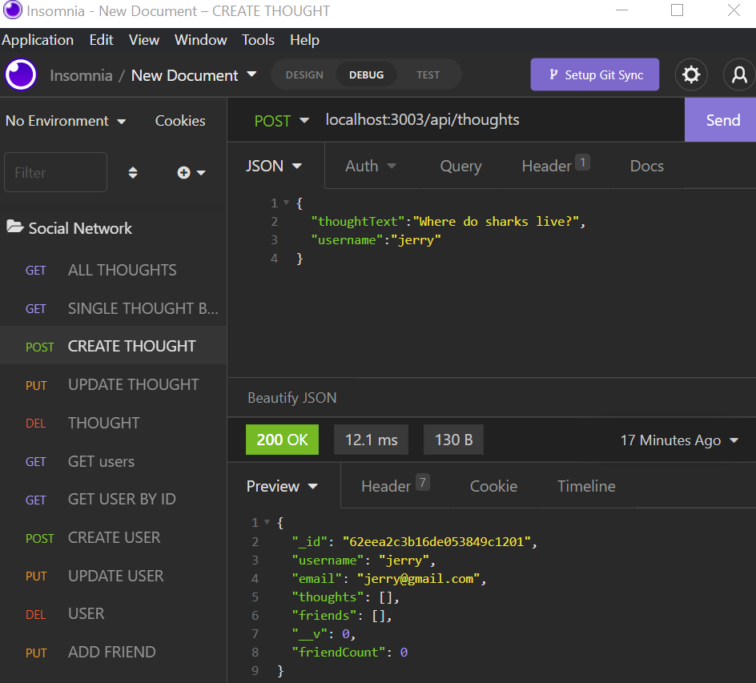

# Social Network API

  

## Table-of-Contents

  * [Description](#description)
  * [Installation](#installation)
  * [Usage](#usage)
  * [License](#license)
  * [Tests](#tests)
  * [Questions](#questions)
  * [Contributers](#contributers)
  

  ## [Description:](#table-of-contents)

  #### This is an API for a social network web application where users can share their thoughts, react to friends' thoughts, and create a friend list. It uses Express.js for routing, a MongoDB database, the Mongoose ODM. The seeds is created using Insomnia.
  
   

  ## User Story
  #### AS A social media startup
  #### I WANT an API for my social network that uses a NoSQL database
  #### SO THAT my website can handle large amounts of unstructured data

  ## [Installation](#table-of-contents)

  #### To invoke application run: npm start. When the server is started, the Mongoose models are synced to the MongoDB database. 

  ## [Usage](#table-of-contents)

  #### To create routes, use Insomnia. 

  

  
  ## License
    
  The application is covered under the following license:
    
  
  
    

  ## [Tests](#table-of-contents)

  #### Running seed routes in Insomnia or other application.

  ## [Questions](#table-of-contents)

  Please contact me using the following links:
  

  * [GitHub](http://github.com/angelagola-ko)

  * [Email: angealgola.ko@gmail.com](mailto:angealgola.ko@gmail.com)

  ## [Contributers](#table-of-contents)

  * Angela Gola &copy;2022 All Rights Reserved.

  